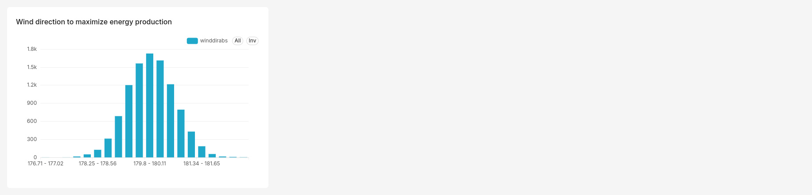

# 🌬️ Turbine Wind Direction Analytics Pipeline

A data pipeline that takes raw wind sensor readings and turns them into a practical recommendation: which way should wind turbines face? Built using Domain-Driven Design and the Medallion Architecture, and fully automated with Apache Airflow.

---

## 🎯 Problem
*(Business Analyst perspective)*

Imagine you want to know the "average" wind direction at a wind farm. Sounds simple — just average the numbers, right? Actually, no.

Wind direction is measured in degrees (0°–360°, like a compass). The problem: if the wind blows at 350° half the time and 10° the other half, a normal average gives you 180° — which is the *opposite* direction of the real answer (which should be close to 0°/360°, north). Regular averaging breaks on compass-style data.

**What this project solves:** calculating the *correct* average wind direction automatically, using the right math for angles — not the math you'd use for regular numbers.

## 🏢 Business Context
*(Business Analyst perspective)*

Why does this matter? Wind farm engineers use the average wind direction to make two real decisions:

- **Which way turbines should point by default**, so they don't waste energy constantly rotating to catch the wind.
- **Where to physically place turbines** on the site, so one turbine doesn't block the wind from reaching another one behind it.

If the average direction is calculated wrong, both of these decisions end up wrong too — costing the wind farm real money in lost efficiency and unnecessary wear on equipment.

## 🧠 Proposed Solution & Architecture
*(Architect perspective)*

The data flows through three simple stages, known as the **Medallion Architecture**:

| Layer | What happens here |
|---|---|
| 🥉 Bronze | Raw sensor readings are saved exactly as they come in |
| 🥈 Silver | Bad or impossible readings (outside 0°–360°) are filtered out |
| 🥇 Gold | The correct average direction is calculated and saved |

The code is also organized so the "business logic" (the math and rules) is kept completely separate from the "technical plumbing" (database, files):

- **`src/domain/`** — the actual logic: what counts as a valid reading, and how to calculate the average correctly. This part doesn't know or care that a database exists.
- **`src/infrastructure/`** — the technical side: talking to PostgreSQL, reading CSV files, moving data between layers.

Why split it this way? Because the math (the part that really matters) can be checked and understood on its own, without needing to know anything about databases or Docker.

## 🧮 How the Average is Calculated
*(Architect perspective)*

Instead of just averaging the degree numbers directly, the pipeline treats each wind direction as an arrow pointing in that direction. It averages the arrows (not the numbers), and then converts the result back into a compass direction.

In plain terms: this is the one decision in the whole project that actually matters most — get this wrong, and every result downstream is wrong too, even though the code would still "work" without any errors.

## 📊 Visualizations
*(Data Analyst perspective)*

Here's what 352 individual wind readings look like, plotted in Apache Superset:



Most readings cluster tightly around 179–180°, forming a bell-shaped curve. This is a good sign — it visually confirms that the calculated average (also around 180°) makes sense given the raw data, rather than being thrown off by a calculation mistake.

## 🔍 Decisions & Rationale
*(Architect + Data Analyst perspective)*

| What we chose | Why |
|---|---|
| Special "compass-style" averaging instead of normal averaging | Normal averaging gives a wrong, sometimes opposite, answer for directional data |
| Apache Airflow instead of just running a script | In a real company, nobody manually re-runs a script every day — Airflow runs it automatically and tells you if something breaks |
| Docker Compose for everything | Anyone can start the entire project — database, automation, dashboard — with a single command, no manual setup |
| A real dashboard (Superset) instead of a saved image | A dashboard can be viewed live in a browser by anyone, anytime, rather than looking at a static picture someone made once |
| Keeping the math separate from the database code | Makes it possible to check the math is correct without needing a database at all |

## 🛠️ Tech Stack

- **Language:** Python 3.10
- **Approach:** Domain-Driven Design (DDD)
- **Database:** PostgreSQL 16
- **Automation:** Apache Airflow (runs the pipeline: `wind_analytics_pipeline`)
- **Dashboard:** Apache Superset
- **Runs everywhere via:** Docker & Docker Compose

## 📚 Sources

- The "compass-style" averaging method is a standard approach for direction data — [Wikipedia: Circular mean](https://en.wikipedia.org/wiki/Circular_mean)
- Sample wind turbine sensor data: Kaggle

## 📈 Result
*(Problem Solver / Product Owner perspective)*

The pipeline calculates a correct average wind direction of **179.99°** — essentially due south — fully automatically, from raw data to final result.

**What this means in practice:**

1. **Turbines should default to facing 179.99°.** This reduces how much they need to rotate throughout the year, which means less mechanical wear.
2. **Turbines should be arranged in rows running East–West.** Since the wind consistently comes from the North-South direction, this layout stops turbines from blocking wind from reaching each other.

In short: this isn't just "a number was calculated" — it's a concrete recommendation an engineer could actually use.

---

## ▶️ How to Run

```bash
docker compose up -d --build
```

This starts everything you need:
- PostgreSQL (database) on port `5433`
- Airflow (automation) at `http://localhost:8080`
- Superset (dashboard) at `http://localhost:8088`

The first time you run it, set up the Airflow and Superset logins:

```bash
docker exec -it wind_airflow airflow users list   # check default admin (standalone mode)

docker exec -it wind_superset superset db upgrade
docker exec -it wind_superset superset fab create-admin --username admin --firstname Admin --lastname User --email admin@admin.com --password admin
docker exec -it wind_superset superset init
```

Then go to the Airflow UI, find the `wind_analytics_pipeline` DAG, and trigger it to run the whole pipeline from start to finish.

## 🛠️ Project Structure

```
wind_analytics/
├── dags/
│   └── wind_dag.py            # Tells Airflow what to run and in what order
├── docs/
│   └── dashboard.png          # Dashboard screenshot
├── src/
│   ├── domain/
│   │   ├── analytics.py       # The averaging math
│   │   ├── repository.py      # Defines what a "repository" must be able to do
│   │   └── wind_turbine.py    # A single wind reading, with validation
│   ├── infrastructure/
│   │   ├── csv_loader.py
│   │   ├── database.py
│   │   ├── repository.py      # Actual PostgreSQL implementation
│   │   ├── silver_loader.py
│   │   └── gold_loader.py
│   └── main.py
├── docker-compose.yml         # Defines the full stack: Postgres, Airflow, Superset
├── Dockerfile.superset        # Custom Superset setup
├── .gitignore
└── README.md
```
